# **BUỔI 2: CƠ BẢN VỀ THIẾT KẾ CƠ SỞ DỮ LIỆU**
---
---
## 1. Lý thuyết cơ bản về thiết kế cơ sở dữ liệu:
- Thiết kế cơ sở dữ liệu có thể được định nghĩa là một tập hợp các thủ tục đảm bảo hệ thống lưu trữ dữ liệu hiệu quả, nhất quán và dễ mở rộng
- Thiết kế cơ sở dữ liệu tốt giúp có được thông tin đúng khi cần.
- Một số điểm quan trọng cần lưu ý để đạt được thiết kế cơ sở dữ liệu tốt:
  - Tính nhất quán và tính toàn vẹn của dữ liệu phải được duy trì. 
  - Không dư thừa 
  - Tìm kiếm nhanh hơn thông qua các chỉ số
  - Các biện pháp bảo mật nên được thực hiện bằng cách thực thi các ràng buộc toàn vẹn khác nhau
  - Dữ liệu nên được lưu trữ thông tin ở định dạng nguyên tử nhất có thể.
- Quá trình thiết kế một CSDL:
  - **Bước 1.** Phân tích yêu cầu
    - Suy luận về các use case sẽ được sử dụng để ngăn chặn các vấn đề phát sinh
    - Các yêu cầu về hiệu năng của hệ thống
  - **Bước 2.** Thiết kế CSDL mức khái niệm
    - Mô tả tổng quát về dữ liệu và các ràng buộc cần thiết trên dữ liệu này
  - **Bước 3.** Thiết kế CSDL mức logic
    - Thiết kế ở mức trừu tượng cao dạ vào những yêu cầu đã phân tích được, không quan tâm về thiết kế mức vật lý
    - Xác định các loại dữ liệu, kiểu dữ liệu được lưu, và mối quan hệ giữa các thực thể
    - Ở bước này cũng cần cải tiến lược đồ, chuẩn hóa để ngăn chặn dư thừa dữ liệu
  - **Bước 4.** Thiết kế CSDL mức vật lý
    - Tất cả các mối quan hệ giữa các ràng buộc dữ liệu và tính toàn vẹn được cài đặt để duy trì tính nhất quán và tạo cơ sở dữ liệu thực tế.
  - **Bước 5.** Thiết kế an toàn bảo mật
    - Phân quyền vai trò của nhóm người dùng
---
## 2. Lược đồ quan hệ E-R:
- Mô hình thực thể-liên kết (Entity-Relationship, viết tắt ER) là một mô hình dữ liệu mức quan niệm nhằm mô tả các đối tượng trong thế giới thực và quan hệ giữa chúng
- Lược đồ thực thể liên kết gồm 3 khái niệm cơ bản: tập thực thể, tập quan hệ và thuộc tính.
### 2.1 Thực thể:
- Thực thể: Là một đối tượng tồn tại trong thế giới thực (1 người, 1 chiếc xe, 1 ngôi nhà) hoặc có thể là cũng có thể là đối tượng trừu tượng (1 công ty, 1 công việc, 1 môn học, 1 khoản vay, …)
- Tập thực thể: Một tập hợp tất cả các thực thể được gọi là một tập hợp thực thể.
- *Ví dụ:* Học sinh Nguyễn Văn A là thực thể còn tập hợp học sinh là tập thực thể
- Các loại thực thể:
  - Thực thể mạnh: Một thực thể mạnh là một loại thực thể có khóa chính. Thực thể mạnh không phụ thuộc vào thực thể khác trong lược đồ. Nó có một khóa chính, giúp xác định nó một cách duy nhất. 
  
  - Thực thể yếu: Một thực thể yếu không thể xác định được khóa chính,  thực thể yếu sẽ phụ thuộc vào 1 thực thể mạnh sở hữu nó.
  
### 2.2 Thuộc tính:
- Thuộc tính: Là 1 đặc trưng mà trị của nó tham gia vào việc mô tả một thực thể Mỗi thuộc tính có một tập giá trị cho phép, được gọi là miền (hay tập giá trị) của thuộc tính đó.
- *Ví dụ:* Sinh viên có họ tên, ngày sinh, mã sinh viên,...
  - Các loại thuộc tính:
    - Thuộc tính đơn: là thuộc tính không bao gồm các thành phần cấu thành
    
    - Thuộc tính kép: là thuộc tính bao gồm các thành phần con cấu thành
    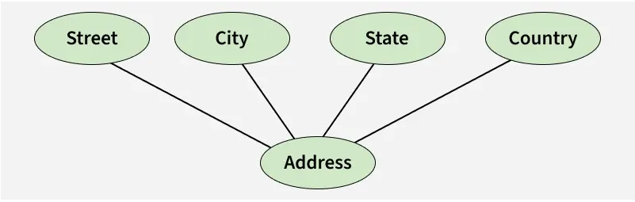
    - Thuộc tính đa trị: Thuộc tính đa giá trị là thuộc tính có nhiều hơn một giá trị cho một thực thể nhất định
    
    - Thuộc tính dẫn xuất: Thuộc tính có thể được suy ra từ các thuộc tính khác của kiểu thực thể được gọi là thuộc tính dẫn xuất
    
    - Thuộc tính khóa chính: Thuộc tính xác định duy nhất mỗi thực thể trong tập thực thể được gọi là thuộc tính khóa
    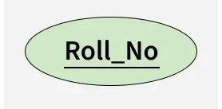
    - Thuộc tính khóa phân biệt của một tập thực thể yếu
### 2.3: Quan hệ:
- Quan hệ: Là sự liên kết hoặc tương tác có ý nghĩa thực tế giữa hai hay nhiều thực thể cụ thể.
- *Ví dụ:* Học sinh Nguyễn Văn A đăng ký môn Cơ sở dữ liệu (sự kiện "đăng ký" chính là một quan hệ)
- Với một tập quan hệ hai ngôi R giữa tập thực thể A và B, ánh xạ lực lượng liên kết gồm:
  - 1 : 1: Khi mỗi thực thể trong mỗi tập hợp thực thể chỉ có thể tham gia một lần vào mối quan hệ
  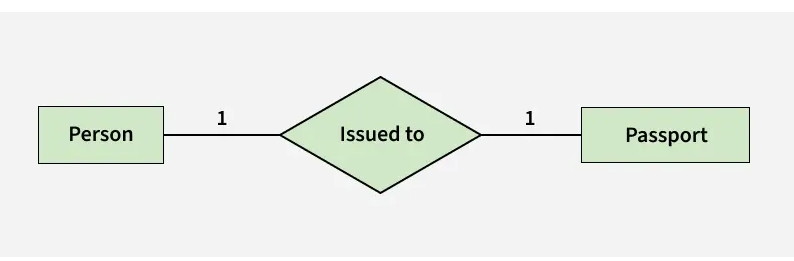
  - 1 : N: một thực thể có thể được liên kết với nhiều thực thể khác
  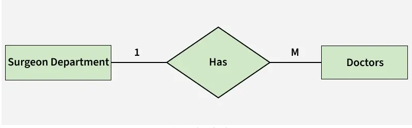
  - N : 1: Tương tự 1 : N
  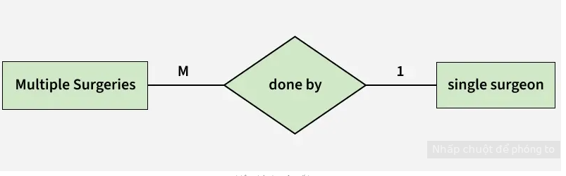
  - N : N: Khi các thực thể trong tất cả các tập thực thể có thể tham gia nhiều hơn một lần vào mối quan hệ
  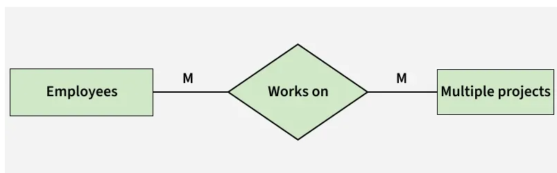
- Tham gia toàn bộ: Mỗi thực thể trong tập thực thể phải tham gia vào mối quan hệ
- Tham gia một phần: Thực thể trong tập hợp thực thể có thể tham gia hoặc KHÔNG tham gia vào mối quan hệ
  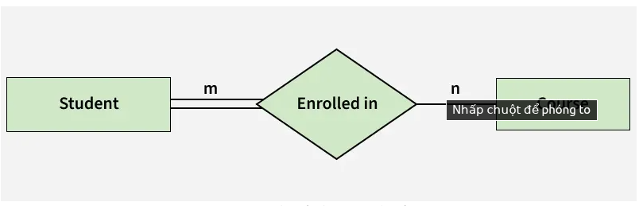
---
## 3. Mô hình dữ liệu quan hệ:
- Mô hình dữ liệu quan hệ do Edgar F. Codd đề xuất năm 1970, tổ chức dữ liệu thành các bảng hai chiều gồm hàng và cột, bao gồm các thành phần:
  - Quan hệ là một bảng (ma trận) với các hàng và các cột, lưu giữ thông tin về các đối tượng được mô hình hóa trong CSDL.
  - Thuộc tính là các cột được đặt tên trong một quan hệ. Mỗi thuộc tính là một đặc tính của một thực thể (hay một quan hệ) được mô hình hóa trong CSDL. Các thuộc tính có thể xuất hiện theo bất kỳ thứ tự nào trong quan hệ
  - Miền giá trị là một tập các giá trị có thể có của một hoặc nhiều thuộc tính. Mỗi thuộc tính được xác định trên một miền giá trị.
- Các bước chuyển đổi:
  - Bước 1. Chuyển đổi thực thể mạnh
    - Mỗi thực thể thông thường trong mô hình thực thể liên kết sẽ được chuyển đổi thành một lược đồ quan hệ.
    - Tên của quan hệ thường là tên của thực thể.
    - Mỗi thuộc tính đơn của thực thể là một thuộc tính của lược đồ quan hệ.
    - Thuộc tính xác định thực thể trở thành khóa chính của quan hệ tương ứng.
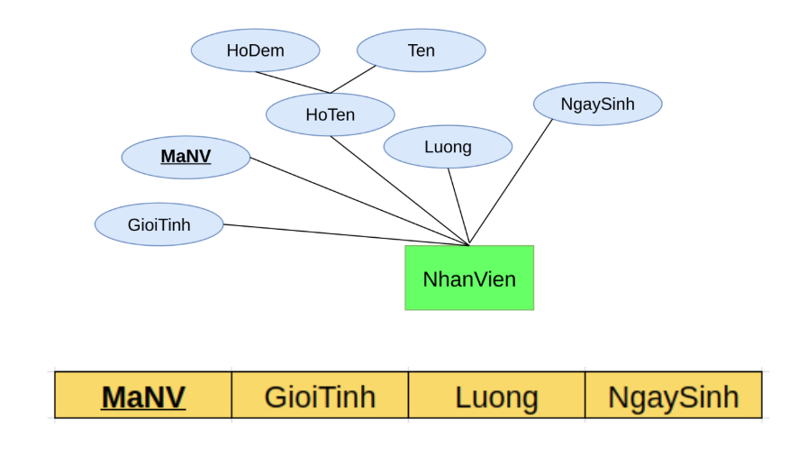
    - Thuộc tính kép: Nếu thực thể có thuộc tính kép thì chỉ những thuộc tính đơn của thuộc tính kép này được đưa vào lược đồ quan hệ mới.
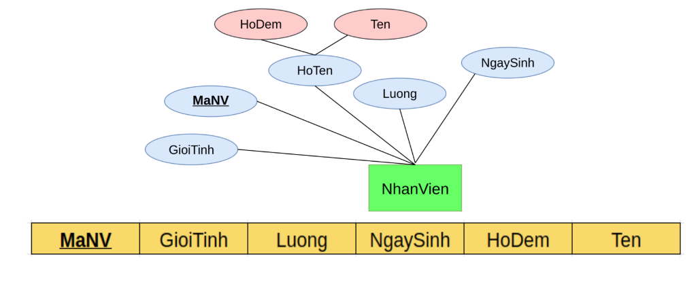
    - Thuộc tính đa trị: Nếu một thực thể thường có một thuộc tính đa trị thì hai lược đồ quan hệ mới sẽ được tạo ra.
      - Lược đồ quan hệ thứ nhất chứa tất cả các thuộc tính của thực thể trừ thuộc tính đa trị.
      - Lược đồ quan hệ thứ hai sẽ có hai thuộc tính cấu thành khóa chính.
        - Thuộc tính thứ nhất là khoá chính của lược đồ quan hệ thứ nhất
      => nó sẽ trở thành khóa ngoại trong lược đồ thứ hai.
        - Thuộc tính thứ hai là thuộc tính đa trị.
      - Tên của lược đồ thứ hai nên được đặt để thể hiện ngữ nghĩa của thuộc tính đa trị.
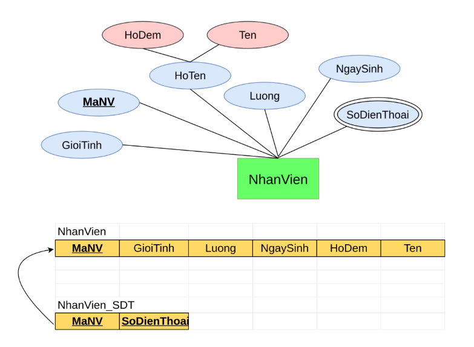
  - Bước 2. Chuyển đổi thực thể yếu
    - Đối với thực thể yếu, tạo một lược đồ quan hệ mới và đưa tất cả các thuộc tính đơn (hoặc các thành phần đơn của các thuộc tính kép) vào thành thuộc tính của lược đồ quan hệ này.
    - Sau đó, thêm khóa chính của quan hệ xác định vào thành một thuộc tính khóa ngoại trong lược đồ quan hệ mới.
    - Khóa chính của lược đồ quan hệ mới là sự kết hợp của khoá chính của quan hệ xác định và thuộc tính phân biệt của thực thể yếu.
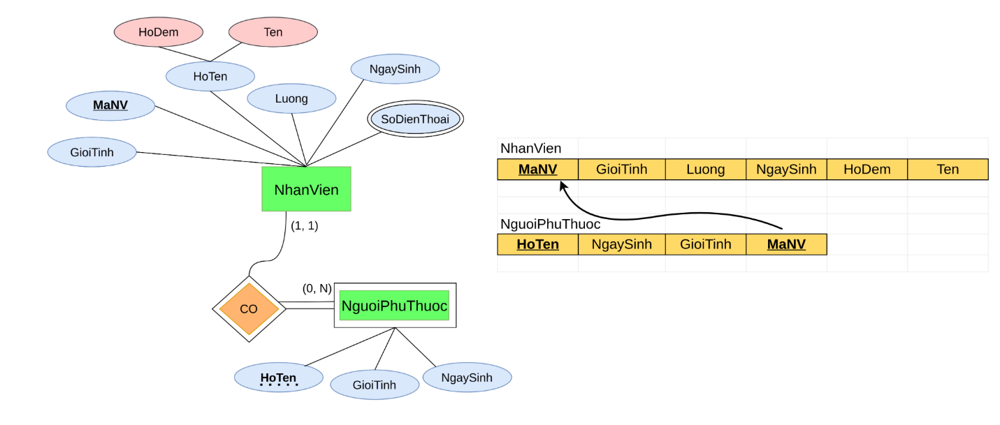
  - Bước 3. Chuyển đổi các quan hệ
    - Quan hệ 1-1:
      - Thêm khóa chính của thực thể A vào thực thể B để thành khóa ngoại cho thực thể B
      => Khóa ngoại nằm ở 1 trong 2 tập thực thể, ưu tiên tập thực thể tham gia đầy đủ. 
      - Ví dụ: Công dân (1)<---->(1) CCCD, ta sẽ thêm cột mã công dân vào bảng của cccd  
  Bảng CONG_DAN: MaCongDan (Khóa chính), HoTen, NgaySinh.
  Bảng CCCD: SoCCCD (Khóa chính), NgayCap, NoiCap, MaCongDan
    - Quan hệ 1-N
      - Thêm các thuộc tính khóa chính của thực thể bên phía 1 của mối quan hệ thành khóa ngoại cho quan hệ nằm ở bên phía N của mối quan hệ (khóa chính lấy từ bên phía N của mối quan hệ).
⇒ Khóa ngoại nằm ở phía Nhiều
      - Quan hệ 1-N và N-1 là đối xứng nhau.
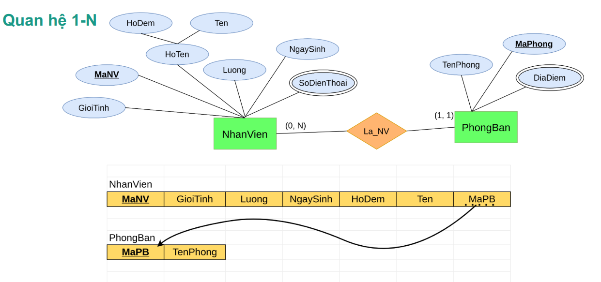
    - Quan hệ N-N
      - Đầu tiên phải tạo thêm một lược đồ quan hệ mới C. Khóa của lược đồ C là sự kết hợp khóa chính của các tập thực thể tham gia vào quan hệ và các khóa chính này cũng là khóa ngoại của C.
      - Các thuộc tính không phải là khóa mà liên quan tới quan hệ N-N giữa A và B cũng được đưa vào lược đồ quan hệ C.
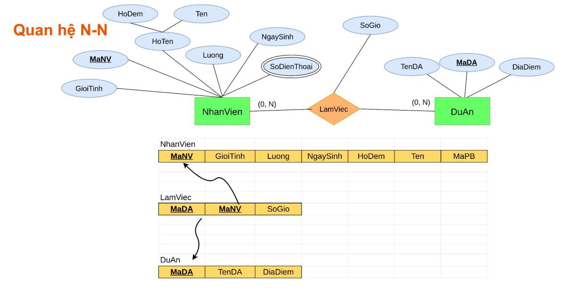
---
## 4. Chuẩn hóa dữ liệu: 1NF, 2NF, 3NF:
### 4.1. Chuẩn hóa 1NF:
- Mỗi ô chỉ chứa 1 giá trị duy nhất (atomic values)
- Không có nhóm lặp lại (repeating groups)
- Có primary key duy nhất

**Ví dụ vi phạm:**
```sql
-- SAAAI: Một ô có nhiều giá trị
CREATE TABLE students (
    id INT PRIMARY KEY,
    name VARCHAR(100),
    subjects VARCHAR(200)  -- "Math, Physics, Chemistry" ❌
);
```
**Cách sửa**
```sql
-- ĐÚNG: Tách ra bảng riêng
CREATE TABLE students (
    id INT PRIMARY KEY,
    name VARCHAR(100)
);

CREATE TABLE student_subjects (
    student_id INT,
    subject VARCHAR(50),
    PRIMARY KEY(student_id, subject),
    FOREIGN KEY(student_id) REFERENCES students(id)
);
```
### 4.2. Chuẩn hóa 2NF:
- Đã đạt chuẩn 1NF
- Không có Partial Dependency
- **Partial Dependency:** Khi một cột không phải primary key chỉ phụ thuộc vào một phần của composite primary key

**Ví dụ vi phạm:**
```sql
-- SAAAI: Partial dependency
CREATE TABLE order_details (
    order_id INT,           -- Phần 1 của composite PK
    product_id INT,         -- Phần 2 của composite PK
    product_name VARCHAR(100),    -- ❌ CHỈ phụ thuộc product_id
    product_price DECIMAL(10,2),  -- ❌ CHỈ phụ thuộc product_id
    quantity INT,                 -- ✅ Phụ thuộc CẢ 2
    line_total DECIMAL(10,2),     -- ✅ Phụ thuộc CẢ 2
    
    PRIMARY KEY(order_id, product_id)
    FOREIGN KEY(product_id) REFERENCES products(id)
);
```
**Cách sửa**
```sql
-- Thêm 2 cột name và price vào products
CREATE TABLE products (
    id INT PRIMARY KEY,
    name VARCHAR(100) NOT NULL,
    price DECIMAL(10,2) NOT NULL,
    supplier_name VARCHAR(100)
);


-- Xóa đi 2 cột product_name và product_price trong order_details
CREATE TABLE order_details (
    order_id INT,
    product_id INT,
    quantity INT NOT NULL,
    line_total DECIMAL(10,2) NOT NULL,
    
    PRIMARY KEY(order_id, product_id),
    FOREIGN KEY(product_id) REFERENCES products(id)
);
```
### 4.3. Chuẩn hóa 3NF:
- Đã đạt chuẩn 2NF
- Không có Transitive Dependency
- **Transitive Dependency:** Khi một cột không phải primary key phụ thuộc vào cột không phải primary key khác

**Ví dụ vi phạm:**
```sql
-- ❌ BẢNG VI PHẠM 3NF
CREATE TABLE employees (
    id INT PRIMARY KEY,              -- Single PK
    name VARCHAR(100),               -- ✅ Direct: id → name
    email VARCHAR(100),              -- ✅ Direct: id → email
    department_id INT,               -- ✅ Direct: id → department_id
    department_name VARCHAR(100),    -- ❌ Transitive: id → department_id → department_name
    department_location VARCHAR(100), -- ❌ Transitive: id → department_id → department_location
    department_budget DECIMAL(12,2), -- ❌ Transitive: id → department_id → department_budget
    salary DECIMAL(10,2)             -- ✅ Direct: id → salary
    
    FOREIGN KEY(department_id) REFERENCES departments(id)
);
```
**Cách sửa**
```sql
-- ✅ BẢNG 1: Employees (chỉ thông tin nhân viên)
CREATE TABLE employees (
    id INT PRIMARY KEY,
    name VARCHAR(100) NOT NULL,
    email VARCHAR(100) UNIQUE NOT NULL,
    department_id INT NOT NULL,
    salary DECIMAL(10,2),
    hire_date DATE,
    
    FOREIGN KEY(department_id) REFERENCES departments(id)
);

-- ✅ BẢNG 2: Departments (chỉ thông tin phòng ban) 
CREATE TABLE departments (
    id INT PRIMARY KEY,
    name VARCHAR(100) NOT NULL,
    location VARCHAR(100),
    budget DECIMAL(12,2),
    manager_id INT,
    
    FOREIGN KEY(manager_id) REFERENCES employees(id)
);
```
