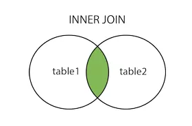
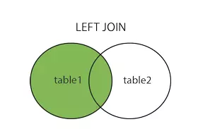
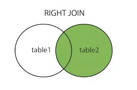

# **BUỔI 3: SQL cơ bản**
---
- [**BUỔI 3: SQL cơ bản**](#buổi-3-sql-cơ-bản)
  - [1. Các thao tác cơ bản:](#1-các-thao-tác-cơ-bản)
    - [1.1 Câu lệnh ``SELECT``:](#11-câu-lệnh-select)
    - [1.2 Câu lệnh ``SELECT DISTINCT``](#12-câu-lệnh-select-distinct)
    - [1.3 Câu lệnh ``INSERT INTO``](#13-câu-lệnh-insert-into)
    - [1.4 Câu lệnh ``UPDATE``](#14-câu-lệnh-update)
    - [1.5 Câu lệnh ``DELETE``](#15-câu-lệnh-delete)
    - [1.6 Từ khóa ``AS``](#16-từ-khóa-as)
  - [2. Lọc dữ liệu:](#2-lọc-dữ-liệu)
    - [2.1 Câu lệnh ``WHERE``:](#21-câu-lệnh-where)
    - [2.2 Câu lệnh ``HAVING``:](#22-câu-lệnh-having)
  - [3. Kết hợp bảng và kết quả:](#3-kết-hợp-bảng-và-kết-quả)
    - [3.1 Các loại ``JOIN``:](#31-các-loại-join)
      - [3.1.1 Câu lệnh ``INNER JOIN`` hay ``JOIN``:](#311-câu-lệnh-inner-join-hay-join)
      - [3.1.2 Câu lệnh ``LEFT JOIN``:](#312-câu-lệnh-left-join)
      - [3.1.3 Câu lệnh ``RIGHT JOIN``:](#313-câu-lệnh-right-join)
      - [3.1.4 Câu lệnh ``CROSS JOIN``:](#314-câu-lệnh-cross-join)
    - [3.2 Các loại ``UNION``:](#32-các-loại-union)
      - [3.2.1 Câu lệnh ``UNION``:](#321-câu-lệnh-union)
      - [3.2.2 Câu lệnh ``UNION ALL``:](#322-câu-lệnh-union-all)
  - [4. Tổng hợp và nhóm dữ liệu:](#4-tổng-hợp-và-nhóm-dữ-liệu)
    - [4.1 Aggregate Function:](#41-aggregate-function)
    - [4.2 Lệnh ``GROUP BY``](#42-lệnh-group-by)
  - [5. Truy vấn con:](#5-truy-vấn-con)
    - [5.1 Định nghĩa:](#51-định-nghĩa)
    - [5.2 Các loại subquery:](#52-các-loại-subquery)
      - [5.2.1 Single-Row Subquery:](#521-single-row-subquery)
      - [5.2.2 Multiple-Row Subquery:](#522-multiple-row-subquery)
      - [5.2.3 Multiple-Column Subquery:](#523-multiple-column-subquery)
      - [5.2.4 Correlated Subquery:](#524-correlated-subquery)
  - [6. Thứ tự thực thi logic của truy vấn:](#6-thứ-tự-thực-thi-logic-của-truy-vấn)

---
## 1. Các thao tác cơ bản:
### 1.1 Câu lệnh ``SELECT``:
**Định nghĩa:** Câu lệnh ``SELECT`` được dùng để lựa chọn dữ liệu từ một cơ sở dữ liệu. Kết quả được lưu trong một bảng kết quả và gọi là bộ kết quả.
**Cú pháp:**
- Lựa chọn tất cả:
```sql
SELECT * FROM table_name;
```
- Lựa chọn từ các cột trong 1 bảng:
```sql
SELECT column_name,column_name
FROM table_name
```
### 1.2 Câu lệnh ``SELECT DISTINCT``
**Định nghĩa:** Câu lệnh ``SELECT DISTINCT`` được dùng để trả về chỉ các giá trị khác nhau.
**Cú pháp:**
```sql
SELECT DISTINCT column_name,column_name
FROM table_name;
```
### 1.3 Câu lệnh ``INSERT INTO``
**Định nghĩa:** Câu lệnh ``INSERT INTO`` của SQL dùng để cho bản ghi mới vào trong một bảng.
**Cú pháp:** 
- Chỉ chỉ định giá trị, không chỉ định tên cột sẽ insert:
```sql
INSERT INTO table_name
VALUES (value1,value2,value3,...);
```
- Chỉ định cả tên cột và giá trị sẽ insert:
```sql
INSERT INTO table_name (column1,column2,column3,...)
VALUES (value1,value2,value3,...);
```
### 1.4 Câu lệnh ``UPDATE``
**Định nghĩa:** Câu lệnh ``UPDATE`` được dùng để cập nhật bản ghi đã có trong một bảng.
**Cú pháp:**
```sql
UPDATE table_name
SET column1=value1,column2=value2,...
WHERE some_column=some_value;
```
### 1.5 Câu lệnh ``DELETE``
**Định nghĩa:** Câu lệnh ``DELETE`` dùng để xóa một dòng trong một bảng.
**Cú pháp:**
```sql
DELETE FROM table_name
WHERE some_column=some_value;
```
- Xóa hết các bản ghi:
```sql
DELETE * FROM table_name;
```
### 1.6 Từ khóa ``AS``
**Định nghĩa:** ``AS`` là từ khóa được sử dụng để tạo một bí danh (alias). Nó giúp đặt một tên tạm thời cho cột hoặc bảng trong quá trình thực thi câu lệnh truy vấn.
**Cú pháp:**
- Đặt tên cho cột:
```sql
SELECT ten_cot AS ten_alias_moi
FROM ten_bang;
```
- Đặt tên cho bảng (thường thì sẽ không viết ``AS`` khi đặt cho bảng):
```sql
SELECT b.ten_cot
FROM ten_bang AS b;
```
---
## 2. Lọc dữ liệu:
### 2.1 Câu lệnh ``WHERE``:
**Định nghĩa:** Mệnh đề WHERE được dùng để lọc các bản ghi, trích xuất ra chỉ các bản ghi thỏa mãn tiêu chí chỉ định.
**Cú pháp:** 
```sql
SELECT column_name,column_name
FROM table_name
WHERE column_name operator value;
```
### 2.2 Câu lệnh ``HAVING``:
**Định nghĩa:** Mệnh đề ``HAVING`` được sử dụng để lọc dữ liệu sau khi chúng đã được gom nhóm bởi mệnh đề ``GROUP BY``.
**Cú pháp:**
```sql
SELECT column_name1, aggregate_function(column_name2)
FROM table_name
WHERE condition
GROUP BY column_name2
HAVING condition
```
---
## 3. Kết hợp bảng và kết quả:
### 3.1 Các loại ``JOIN``:
#### 3.1.1 Câu lệnh ``INNER JOIN`` hay ``JOIN``:
**Định nghĩa:** Trả về kết quả là các bản ghi mà trường được join hai bảng khớp nhau, các bản ghi chỉ xuất hiện một trong hai bảng sẽ bị loại.

**Cú pháp:** 
- ``INNER JOIN`` một bảng
```sql
SELECT column_name(s)
FROM table1
INNER JOIN table2
ON table1.column_name = table2.column_name;
```
- ``INNER JOIN`` nhiều bảng
```sql
SELECT column_list
FROM table1
INNER JOIN table2 ON join_condition1
INNER JOIN table3 ON join_condition2
```
#### 3.1.2 Câu lệnh ``LEFT JOIN``:
**Định nghĩa:** Trả về tất cả các hàng (rows) từ bảng bên trái (table1), với các hàng tương ứng trong bảng bên phải (table2). Chấp nhận cả dữ liệu NULL ở bảng 2.

**Cú pháp:** 
- ``LEFT JOIN`` một bảng
```sql
SELECT column_name(s)
FROM table1
LEFT JOIN table2
ON table1.column_name = table2.column_name;
```
- ``LEFT JOIN`` nhiều bảng
```sql
SELECT column_list
FROM table1
LEFT JOIN table2 ON join_condition1
LEFT JOIN table3 ON join_condition2
```
#### 3.1.3 Câu lệnh ``RIGHT JOIN``:
**Định nghĩa:** Trả về tất cả các hàng (rows) từ bảng bên phải (table2), với các hàng tương ứng trong bảng bên trái (table1). Chấp nhận cả dữ liệu NULL ở bảng 1. ngược lại với ``LEFT JOIN``

**Cú pháp:** 
- ``RIGHT JOIN`` một bảng
```sql
SELECT column_name(s)
FROM table1
RIGHT JOIN table2
ON table1.column_name = table2.column_name;
```
- ``RIGHT JOIN`` nhiều bảng
```sql
SELECT column_list
FROM table1
RIGHT JOIN table2 ON join_condition1
RIGHT JOIN table3 ON join_condition2
```
#### 3.1.4 Câu lệnh ``CROSS JOIN``:
**Định nghĩa:** Trả về tích Descartes của hai bảng, ``CROSS JOIN`` kết hợp từng hàng của bảng thứ nhất với mọi hàng của bảng thứ hai.
**Cú pháp:** 
- Cú pháp chuẩn:
```sql
SELECT columns
FROM table1
CROSS JOIN table2;
```
- Viết tắt:
```sql
SELECT columns
FROM table1, table2;
```
### 3.2 Các loại ``UNION``:
#### 3.2.1 Câu lệnh ``UNION``:
**Định nghĩa:** Dùng để gộp kết quả của các câu lệnh ``SELECT`` và tự động loại bỏ các dòng trùng lặp. Kết quả trả về chỉ chứa các dòng duy nhất (duy nhất trên tất cả các cột được chọn).
**Cú pháp: (Cũng có thể gộp > 2 bảng)**
```sql
SELECT cot1, cot2 FROM bang1
UNION
SELECT cot1, cot2 FROM bang2;
```
#### 3.2.2 Câu lệnh ``UNION ALL``:
**Định nghĩa:** Dùng để gộp kết quả của các câu lệnh ``SELECT`` và giữ lại toàn bộ các dòng, bao gồm cả các dòng trùng lặp hoàn toàn giữa các bảng.
**Cú pháp: (Cũng có thể gộp > 2 bảng)**
```sql
SELECT cot1, cot2 FROM bang1
UNION ALL
SELECT cot1, cot2 FROM bang2;
```
---
## 4. Tổng hợp và nhóm dữ liệu:
### 4.1 Aggregate Function:
Các hàm tổng hợp (Aggregate Function) trong SQL là các hàm được sử dụng để thực hiện tính toán trên một tập hợp của các giá trị và trả về kết quả tổng hợp của các giá trị đó.

- ``SUM()``: Tính tổng của các giá trị trong một cột.
```sql
SELECT SUM(salary) AS total_salary
FROM employees;
```
- ``AVG()``: Tính trung bình của các giá trị trong một cột.
```sql
SELECT AVG(score) AS average_score
FROM exam_scores;
```
- ``COUNT()``: Đếm số lượng hàng trong một tập hợp.
  - ``COUNT(*)``: Counts the total number of rows in a table (including NULL values).
  - ``COUNT(columnname)``: Counts all non-null values in the column.
  - ``COUNT(DISTINCT columnname)``: Counts only the unique, non-null values in the column.
```sql
SELECT COUNT(ProductID)
FROM Products;
```
- ``MIN()`` và ``MAX()``: Hàm ``MIN()`` trả về giá trị nhỏ nhất trong một cột, trong khi hàm ``MAX()`` trả về giá trị lớn nhất.
```sql
SELECT MIN(age) AS youngest_age, MAX(age) AS oldest_age
FROM employees;
```
### 4.2 Lệnh ``GROUP BY``
**Định nghĩa:** Được sử dụng để gom nhóm các hàng dữ liệu có cùng giá trị tại một (hoặc nhiều) cột thành các nhóm đại diện.
**Cú pháp:** 
```sql
SELECT column1, aggregate_function(column2)
FROM table_name
WHERE condition
GROUP BY column1
ORDER BY column1;
```
---
## 5. Truy vấn con:
### 5.1 Định nghĩa:
Subquery (hoặc còn gọi là truy vấn con) là một truy vấn được nhúng bên trong một truy vấn khác. Subquery thường được sử dụng để trích xuất dữ liệu từ một bảng hoặc nhiều bảng dựa trên kết quả của truy vấn chính. Subquery có thể xuất hiện trong các mệnh đề SELECT, INSERT, UPDATE, DELETE và thậm chí trong một subquery khác.
### 5.2 Các loại subquery:
#### 5.2.1 Single-Row Subquery: 
Subquery trả về duy nhất một hàng kết quả. Thường được sử dụng trong các mệnh đề WHERE hoặc HAVING để so sánh với một giá trị cụ thể.
```sql
SELECT product_name
FROM products
WHERE product_id = (SELECT MAX(product_id) FROM products);
```
#### 5.2.2 Multiple-Row Subquery:
Subquery trả về nhiều hàng kết quả. Thường được sử dụng với các phép toán IN, ANY hoặc ALL để so sánh với tập hợp các giá trị.
```sql
SELECT customer_name
FROM customers
WHERE customer_id IN (SELECT customer_id FROM orders WHERE order_date = '2023-08-01');
```
#### 5.2.3 Multiple-Column Subquery:
Subquery trả về nhiều cột trong kết quả. Điều này thường được sử dụng trong các mệnh đề SELECT để lấy dữ liệu từ nhiều cột.
```sql
SELECT employee_id,
       employee_name
FROM employees
WHERE (department_id, salary) IN (SELECT department_id, MAX(salary) FROM employees GROUP BY department_id);
```
#### 5.2.4 Correlated Subquery:
Subquery chứa tham chiếu đến cột từ bảng ở một truy vấn ngoài. Nó được sử dụng trong các trường hợp mà dữ liệu của subquery phụ thuộc vào dữ liệu của truy vấn bên ngoài.
```sql
SELECT product_name,
       (SELECT AVG(price) FROM products WHERE category = categories.category) AS avg_price
FROM categories;
```
---
## 6. Thứ tự thực thi logic của truy vấn:
1. FROM (và JOIN)
2. WHERE
3. GROUP BY
4. HAVING
5. SELECT/ SELECT DISTINCT
6. DISTINCT
7. ORDER BY
8. LIMIT/OFFSET 
```sql
SELECT DISTINCT                     -- (6) Loại bỏ các kết quả trùng lặp
       c.khu_vuc,                   -- (5) Quyết định cột nào được hiển thị và gán Alias
       COUNT(o.ma_don_hang) AS tong_so_don  
FROM khach_hang c                   -- (1) Xác định bảng gốc để lấy dữ liệu
JOIN don_hang o                     -- (1) Kết nối với bảng khác để gộp dữ liệu
  ON c.ma_khach_hang = o.ma_khach_hang 
WHERE o.ngay_mua >= '2023-01-01'    -- (2) Lọc bỏ các dòng (đơn hàng) trước năm 2023
GROUP BY c.khu_vuc                  -- (3) Gom nhóm các dòng dữ liệu theo từng khu vực
HAVING COUNT(o.ma_don_hang) > 50    -- (4) Chỉ giữ lại các nhóm (khu vực) có trên 50 đơn
ORDER BY tong_so_don DESC           -- (7) Sắp xếp giảm dần (Có thể dùng Alias sinh ra ở bước 5)
LIMIT 10;                           -- (8) Chỉ hiển thị 10 dòng đầu tiên trả về cho người dùng
```
