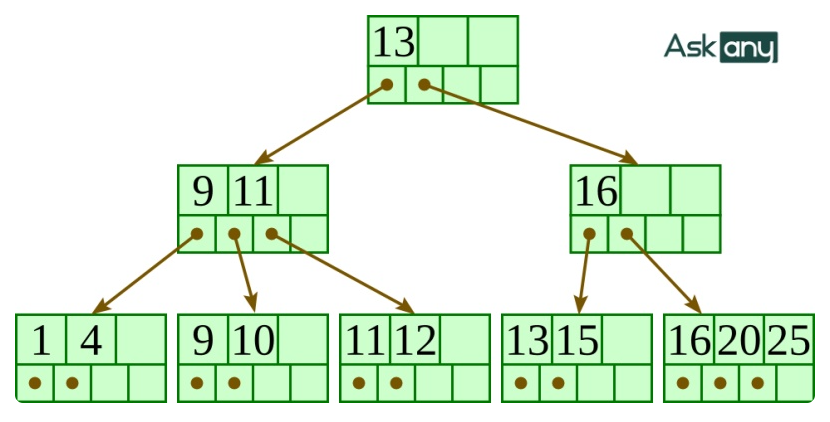
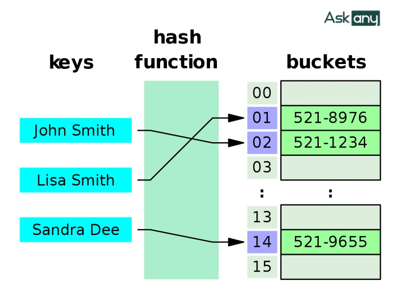

# BUỔI 4: SQL NÂNG CAO
---
- [BUỔI 4: SQL NÂNG CAO](#buổi-4-sql-nâng-cao)
  - [1. Index](#1-index)
    - [1.1 Khái niệm](#11-khái-niệm)
    - [1.2 Các loại index](#12-các-loại-index)
    - [1.3 Cách đánh index](#13-cách-đánh-index)
  - [2. Tối ưu truy vấn](#2-tối-ưu-truy-vấn)
  - [3. Transactions](#3-transactions)
    - [3.1 Khái niệm Transactions](#31-khái-niệm-transactions)
    - [3.2 Các thuộc tính của Transaction:](#32-các-thuộc-tính-của-transaction)
    - [3.3 Dirty Read và Dirty Write](#33-dirty-read-và-dirty-write)
    - [3.4 Thao tác giao dịch cơ bản trong MySQL](#34-thao-tác-giao-dịch-cơ-bản-trong-mysql)

---
## 1. Index
### 1.1 Khái niệm
Đánh index trong SQL là kỹ thuật tạo ra một cấu trúc dữ liệu bổ sung giúp tăng tốc độ truy vấn dữ liệu từ database. Nó hoạt động như một bảng phụ ghi lại vị trí của các giá trị trong một hoặc nhiều cột nhất định, giúp database có thể nhanh chóng xác định dữ liệu cần thiết mà không cần phải quét qua toàn bộ bảng.

**Ưu điểm:**
- Ưu điểm của index là tăng tốc độ tìm kiếm records theo câu lệnh WHERE.
- Không chỉ giới hạn trong câu lệnh SELECT mà với cả xử lý UPDATE hay DELETE có điều kiện WHERE.

**Nhược điểm:**
- Khi sử dụng index thì tốc độ của những xử lý ghi dữ liệu (Insert, Update, Delete) sẽ bị chậm đi, Vì ngoài việc thêm hay update thông tin data thì MYSQL cũng cần update lại thông tin index của bảng tương ứng.
- Ngoài ra việc đánh index cũng sẽ tốn resource của server như thêm dung lượng cho CSDL.
### 1.2 Các loại index
**B-Tree Index:**
- **Tổ chức dữ liệu:** Dữ liệu index trong B-Tree được tổ chức dưới dạng cây, với root, branch và leaf nodes. Giá trị của các node được tổ chức theo thứ tự tăng dần từ trái sang phải.
- **Quy tắc tìm kiếm:** Khi truy vấn dữ liệu, B-Tree thực hiện quá trình tìm kiếm đệ quy, bắt đầu từ root node và đi sâu vào các branch và leaf nodes cho đến khi tìm thấy dữ liệu thỏa mãn điều kiện truy vấn.
- **Sử dụng:** được sử dụng trong các biểu thức so sánh dạng: =, >, >=, <, <=, ``BETWEEN`` và ``LIKE``

- **Cú pháp:** 
*Thông thường khi nói đến index mà không chỉ rõ loại index thì default là sẽ sử dụng B-Tree index.*
```sql

// Create index

CREATE INDEX id_index ON table_name (column_name[, column_name…]);

// Or

ALTER TABLE table_name ADD INDEX id_index (column_name[, column_name…])

//Drop index

DROP INDEX index_name ON table_name
```
**Hash Index:**
- **Tổ chức dữ liệu:** Hash index tổ chức dữ liệu dưới dạng cặp Key - Value qua giải thuật Hash Function (hàm băm).
- **Sử dụng toán tử:** Hash index thường chỉ được sử dụng cho các toán tử so sánh bằng (=) hoặc khác (<>), không thích hợp cho các toán tử so sánh khoảng giá trị như (<) hoặc (>)
- **Tối ưu hóa:** Không thể tối ưu hóa sắp xếp dữ liệu theo thứ tự bằng cách sử dụng Hash index, và nó không hỗ trợ các truy vấn sắp xếp dữ liệu theo thứ tự.
- **Tốc độ:** Hash index thường có tốc độ nhanh hơn so với B-Tree index.

- **Cú pháp:**
```sql
// Create index

CREATE INDEX id_index ON table_name (column_name[, column_name…]) USING HASH;

// Or

ALTER TABLE table_name ADD INDEX id_index (column_name[, column_name…]) USING HASH;

//Drop index

DROP INDEX index_name ON table_name
```
Từ khóa ``INDEX`` và ``UNIQUE INDEX`` trong việc đánh index:
|                   | ``INDEX``                                                                     | ``UNIQUE INDEX``                                                                            |
| ----------------- | ----------------------------------------------------------------------------- | ------------------------------------------------------------------------------------------- |
| **Mục đích chính**   | Chỉ dùng để tối ưu tốc độ truy vấn tìm kiếm.                                  | Đảm bảo tính duy nhất của dữ liệu và tối ưu tốc độ truy vấn.                                |
| **Dữ liệu trùng lặp** | Có.                                                                           | Không. Nếu ``INSERT`` hoặc ``UPDATE`` dữ liệu trùng, database sẽ báo lỗi.                           |
| **Khi nào sử dụng**   | Các trường hay dùng để tìm kiếm hoặc lọc như created_at, status, category_id. | Các trường dữ liệu định danh người dùng/đối tượng như email, username, số điện thoại, CCCD. |

*Mặc định **primary key** thì sẽ là `unique index`*
### 1.3 Cách đánh index
**Đánh index 1 trường:**
- Đây là cách khá thông thường khi chúng ta lựa chọn 1 column được sử dụng nhiều khi tìm kiếm và đánh index cho nó.
- Nhưng có một lưu ý đó là nếu số lượng giá trị unique hay giá trị khác NULL trong column đó quá thấp so với tổng số records của bảng thì việc đánh index lại không có ý nghĩa lắm.

**Đánh index nhiều trường (B-Tree Index)**
- Với trường hợp đánh index trên nhiều columns thì index chỉ có hiệu quả khi search theo thứ tự các trường của index.
- Giả sử có table Customer:
```sql
CREATE TABLE Customer(

    last_name varchar(50) not null,

    first_name varchar(50) not null,

    dob date not null,

    key(last_name, first_name, dob) );
```
- Vậy nếu điều kiện tìm kiếm như dưới thì index sẽ được sử dụng.
```sql
SELECT * FROM Customer WHERE last_name='Peter' AND first_name='Smith'

SELECT * FROM Customer WHERE last_name='Peter'

SELECT * FROM Customer WHERE last_name='Peter' AND first_name='Smith' AND dob= '2006/24/05'
```
- Nhưng trong những trường hợp sau index sẽ không được sử dụng:
```sql
SELECT * FROM Customer WHERE first_name='Smith' AND dob= '2006/24/05';

SELECT * FROM Customer WHERE first_name='Smith' AND last_name='Peter'
```

## 2. Tối ưu truy vấn
**Tránh sử dụng các function và bắt đầu bằng một ``%`` trong wildcard**

VD: 
```sql
SELECT * FROM TABLE1 WHERE UPPER(COL1)='ABC'
```

Khi sử dụng hàm ``UPPER()`` thì cơ sở dữ liệu sẽ không thể sử dụng index của cột COL1 dẫn tới thực hiện câu lệnh chậm hơn. Nếu không còn cách nào khác và bắt buộc phải sử dụng hàm trong so sánh thì nên tạo thêm một chỉ mục dựa trên hàm.

VD: 
```sql
SELECT * FROM TABLE1 WHERE COL1 LIKE '%ABC'
```
Khi sử dụng wildcard (%) ví dụ như '%ABC' gây ra quá trình quét toàn bộ bảng. Trong hầu hết trường hợp sử dụng wildcard gây ra hạn chế về hiệu suất.

**Tránh truy vấn các cột không cần thiết trong câu lệnh SELECT**
Thay vì sử dụng ``SELECT * `` để lấy ra tất cả dữ liệu của hàng hãy chỉ lấy ra những cột sử dụng và thấy cần thiết trong câu lệnh ``SELECT`` giúp nên cao hiệu suất của MySQL. Vì những cột không cần thiết sẽ được thêm vào khi load dữ liệu dẫn tới chậm và hiệu năng bị giảm.

**Sử dụng Inner join thay cho outer join nếu có thể**
Chỉ sử dụng outer join khi nó là lựa chọn duy nhất. Nó không chỉ giới hạn về mặt hiệu năng của cơ sở dữ liệu mà còn hạn chế những tùy chọn tối ưu trong câu truy vấn MySQL.

**Chỉ sử dụng ORDER BY, DISTINCT and UNION khi thực sự cần thiết**
Sử dụng mà không có mục đích nào làm chậm câu truy vấn vì phải thực hiện việc sắp xếp dữ liệu hay lọc các giá trị trùng. Thay vì sử dụng ``UNION`` nếu có thể nên sử dụng ``UNION ALL`` (kết hợp kết quả mà không xóa những cột trùng lặp) sẽ mang lại hiệu suất cao hơn.

**Subqueries và Join**
Theo lý thuyết thì mọi câu lệnh join đều có thể chuyển thành subqueris tuy nhiên cũng nên cân nhắc nên sử dụng subqueries hay join trong từng trường hợp.

- Hiểu một các đơn giản là khi thực hiện câu lệnh ``JOIN`` ta sẽ tạo ra một bảng tạm là dữ liệu gộp của các bảng thỏa mãn mệnh đề ``ON`` và thực hiện ``SELECT`` dữ liệu trong bảng tạm đó.

- Subqueries là việc thực hiện câu lệnh ``IN`` trong dữ liệu từng bảng. Vậy nên với dữ liệu <20K bản ghi thì việc thực hiện ``JOIN`` mang lại hiệu quả cao hơn hằn, khi dữ liệu >100k+ thì thực hiện câu lệnh ``IN`` mang lại kết quả tốt hơn.

## 3. Transactions
### 3.1 Khái niệm Transactions
Có thể hiểu Transaction là một tiến trình xử lý có xác định điểm đầu và điểm cuối, được chia nhỏ thành các operation (phép thực thi) , tiến trình được thực thi một cách tuần tự và độc lập các operation đó theo nguyên tắc hoặc tất cả đều thành công hoặc một operation thất bại thì toàn bộ tiến trình thất bại. Nếu việc thực thi một operation nào đó bị fail đồng nghĩa với việc dữ liệu phải rollback về trạng thái ban đầu.

Có thể lấy ví dụ về 1 Transaction đơn giản nhất là tiến trình cài đặt phần mềm hoặc gỡ bỏ phần mềm. Việc cài đặt được chia thành các bước, thực hiện tuần tự từ đầu đến cuối, nếu toàn bộ các bước thực thi thành công đồng nghĩa với việc tiến trình cài đặt hoặc gỡ bỏ phần mềm thành công và ngược lại, một phép thất bại thì tiến trình phải rollback lại tức sẽ không có bất kỳ thay đổi nào trên máy tính.
### 3.2 Các thuộc tính của Transaction:
Một giao dịch có 4 thuộc tính then chốt (không thể thiếu) được viết tắt là **ACID**
**Atomicity – tính đơn vị:**
Một transaction xác định ranh giới của nó rất rõ ràng, tức xác định điểm bắt đầu và kết thúc của tiến trình. Như vậy có thể coi nó như một đơn vị thực thi và đơn vị thực thi này thực hiện theo nguyên tắc “all or nothing”. Nghĩa là nếu một thành phần nào đó trong transaction thực thi hỏng (fail) thì đồng nghĩa với việc không có gì xảy ra tức không có gì thay đổi về mặt dữ liệu.

**Consistency – nhất quán:**
Đảm bảo cơ sở dữ liệu được thay đổi đúng trạng thái sau khi giao dịch thành công và không xảy ra lỗi.

**Isolation – độc lập:**
Nếu hai transaction thực thi cùng lúc thì nguyên tắc thực thi là thực thi độc lập. Nghĩa là một transaction không thể “nhìn thấy” một transaction khác. “Không nhìn thấy” ở đây là không tác động lẫn nhau, chủ yếu trên dữ liệu.

**Durability – bền vững:**
Dữ liệu của transaction sau khi thực thi xong được cố định, chính thức và bền vững. Nghĩa là những thay đổi đã được cố định, không có chuyện có thể chuyển lại trạng thái dữ liệu lúc trước khi thực hiện transaction.
### 3.3 Dirty Read và Dirty Write
**Dirty Read**
- **Khái niệm:** Xảy ra khi giao dịch A đọc được dữ liệu do giao dịch B thay đổi nhưng chưa được commit (lưu chính thức). Nếu sau đó giao dịch B bị hủy (rollback), dữ liệu mà giao dịch A đã đọc trở thành dữ liệu rác/sai lệch.
- **Ví dụ:** 
  - Số dư tài khoản gốc là 100k.
  - Giao dịch B (T2) cộng thêm 50k thành 150k nhưng chưa commit.
  - Giao dịch A (T1) đọc thấy số dư là 150k.Giao dịch B gặp lỗi và rollback về lại 100k. 
  - Lúc này, giá trị 150k mà A đọc trước đó không có thực.

**Dirty Write** 
- **Khái niệm:** Xảy ra khi giao dịch A ghi đè lên dữ liệu mà một giao dịch B khác đã thay đổi nhưng chưa commit. Nếu B sau đó rollback, dữ liệu của cả hai giao dịch có thể bị rối loạn hoặc mất dấu vết cập nhật.
- **Ví dụ:**
  - Giao dịch B cập nhật trạng thái đơn hàng thành "Đang giao" (chưa commit).
  - Giao dịch A nhảy vào cập nhật ngay trạng thái đơn hàng thành "Đã hủy" (chưa commit).
  - Nếu giao dịch B quay đầu rollback, hệ thống xử lý sai lệch trạng thái thực tế của dữ liệu.

### 3.4 Thao tác giao dịch cơ bản trong MySQL
```sql
START TRANSACTION;

-- Bước 1: Trừ 500k của tài khoản A
UPDATE accounts SET balance = balance - 500000 WHERE id = 1;

-- Bước 2: Cộng 500k cho tài khoản B
UPDATE accounts SET balance = balance + 500000 WHERE id = 2;

-- Bước 3: Lưu lại lịch sử giao dịch
INSERT INTO transaction_history (from_account, to_account, amount) 
VALUES (1, 2, 500000);

-- Nếu mọi thứ hợp lệ:
COMMIT;

-- Nếu có bất kỳ bước nào xảy ra Exception (ví dụ: tài khoản A không đủ số dư khiến DB báo lỗi):
ROLLBACK;
```